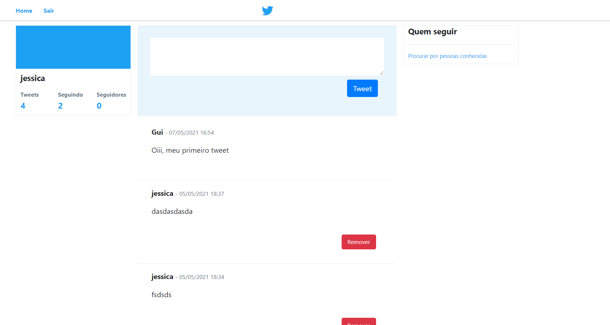

# Twitter-PHP-MVC-MySQL

_Projeto aprendido no Curso de desenvolvimento web completo 2021._

**Banco de dados**  
Na raiz tem o arquivo _querys_banco.sql_ que contém o SQL necessário para montar o banco e as tabelas.
É necessário iniciar o xampp e acessar o msql através do link: http://localhost/phpmyadmin/  

**Maneiras de rodar o app**  
Colocar dentro do xampp ou então iniciar o cmd e entrar dentro da pasta public do projeto e digitar: php -S localhost:8080  e acessar o url: localhost:8080.

**obs:**  
Apenas a pasta _public_ deve ficar dentro da pasta publica (no xampp é a htdocs). Os demais arquivos devem ficar fora da pasta pública.

**Img:**
Página inicia:  

Página Home:

 
